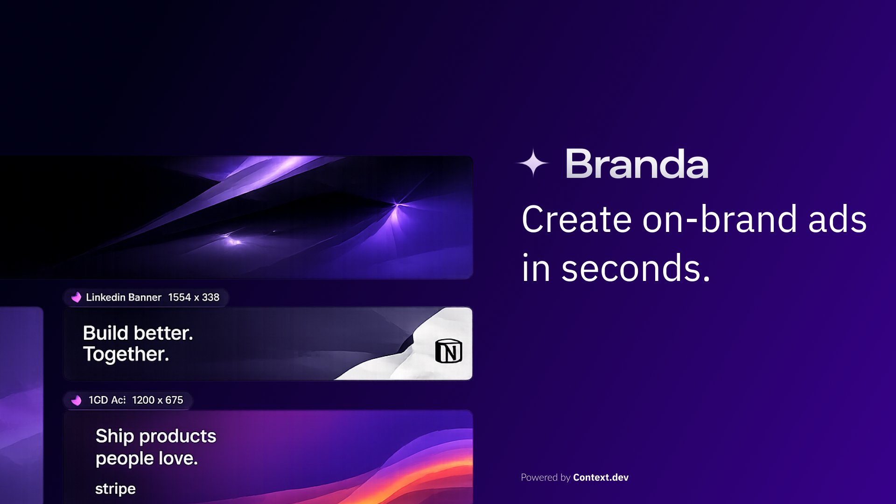
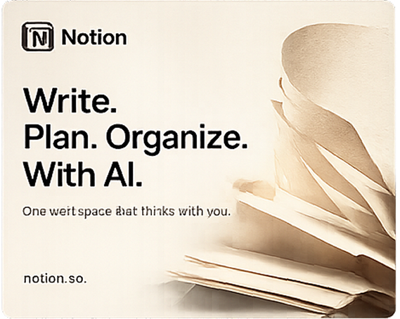
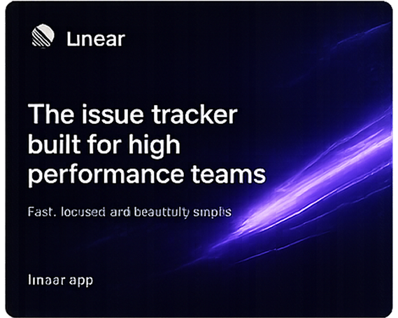
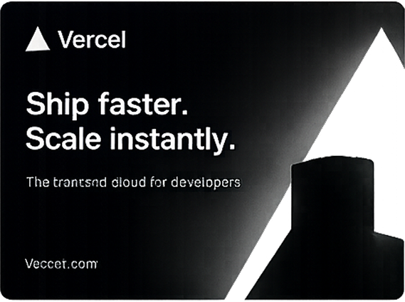
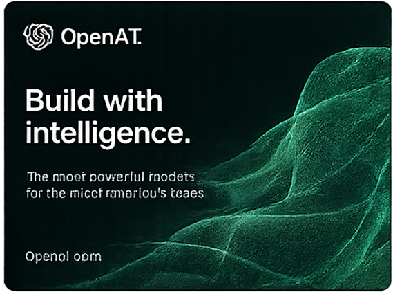
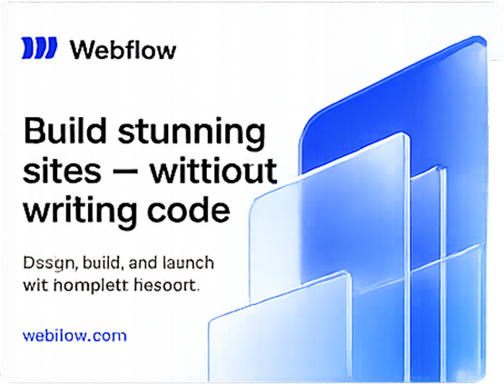

<p align="center">
  
</p>

<p align="center">
  <b>Paste a public domain. Get scroll-stopping, on-brand ads in seconds.</b>
</p>

<p align="center">
  <a href="./LICENSE"></a>
  <a href="https://link.context.dev/branda"></a>
  <a href="#contributing"></a>
  
</p>

> **Make it yours:** fork Branda into your own ad maker, or integrate its brand-research pipeline into an existing repo. [Sign up for Context.dev to get your API key](https://link.context.dev/branda), then follow the [quick start](#quick-start).

<p align="center">
  
</p>

---

## Built by the [Context.dev](https://context.dev) team 🥠

Branda is an open-source ad generator that turns a **public website domain** into four to six polished, on-brand marketing creatives. The hosted experience needs no login, brief, or settings — the domain is the only input. Branda pulls the brand's identity from the [Context.dev Brand API](https://docs.context.dev/api-reference/brand-intelligence/brand), uses its [extracted styleguide](https://docs.context.dev/api-reference/brand-intelligence/styleguide) palette and Google Font when available, and grounds one to three distinct products with [structured web extraction](https://docs.context.dev/api-reference/web-extraction/extract). It then morphs the page in place into a gallery: three company ads followed by one ad for each extracted product.

Paste `notion.com` and Branda will:

- 🎨 Pull the brand's logo and industry plus its [styleguide](https://docs.context.dev/api-reference/brand-intelligence/styleguide) palette and eligible Google Font
- 👀 [Read the homepage as Markdown](https://docs.context.dev/api-reference/web-scraping/markdown) so the copy can reflect the brand's real voice
- 📦 Extract one to three distinct, fact-checked products with Context.dev [`web.extract`](https://docs.context.dev/api-reference/web-extraction/extract) and a JSON Schema generated from Zod
- 🧠 Have an LLM pick a distinct creative direction and write tailored copy for three company ads plus one ad per extracted product
- 🖼️ Render 4–6 distinct 1:1 ads in parallel — every ad uses a **different image model** (OpenAI, xAI, Google, ByteDance, Recraft)
- ⚡ Mark successful briefs and ads for shared-CDN caching to reduce duplicate generation while entries are fresh
- 📥 Download each ad (or every finished ad) and share to X, with best-effort clipboard copying when the browser permits it

---

## Examples

Real outputs, straight from Branda — one public domain in, 4–6 ads out:

| | | |
|:---:|:---:|:---:|
|  |  |  |
| `stripe.com` | `notion.com` | `linear.app` |
|  |  |  |
| `vercel.com` | `openai.com` | `webflow.com` |

Example outputs are illustrative. Product names, logos, and trademarks belong to their respective owners; their appearance here does not imply sponsorship or endorsement, and the MIT license does not grant rights to those third-party marks.

---

## Table of contents

- [What you get](#what-you-get)
- [The 12 creative directions](#the-12-creative-directions)
- [How it works](#how-it-works)
- [Context.dev APIs used](#contextdev-apis-used)
- [Quick start](#quick-start)
- [Configuration](#configuration)
- [Customize or integrate](#customize-or-integrate)
- [Deploy safely](#deploy-safely)
- [Scripts](#scripts)
- [Project structure](#project-structure)
- [Tech stack](#tech-stack)
- [Contributing](#contributing)
- [Built using Context.dev](#built-using-contextdev)
- [License](#license)

---

## What you get

- **Domain → 4–6 ads, one input** — no formats to pick, no messages to write, no style dropdowns. Paste a domain and the page morphs into a live gallery as each ad lands.
- **Grounded in the real brand** — logo and industry come from the [Brand API](https://docs.context.dev/api-reference/brand-intelligence/brand); colors and an eligible Google Font come from the site's [extracted styleguide](https://docs.context.dev/api-reference/brand-intelligence/styleguide), not a generic palette.
- **Company plus products** — every Ad Run starts with exactly three company ads, followed by one to three ads for distinct products extracted and fact-checked against the site with Context.dev.
- **12 creative directions** — an LLM picks one distinct direction per ad, then writes a tailored headline and subheadline for the company or specific product being advertised.
- **Up to 6 image models racing** — `gpt-image-1`, `gpt-image-2`, and `grok-imagine-image` take the three company slots; one to three of `imagen-4.0`, `seedream-4.5`, and `recraft-v4.1` render the product slots. Every ad streams in the moment its model finishes.
- **Fact-grounded copy** — company headlines draw from the real homepage, while Product headlines draw from structured extraction and prompts that require factual positioning.
- **CDN-cacheable** — successful brief and ad responses include shared-cache headers, reducing duplicate generation work behind Vercel or another compatible CDN.
- **All downloadable** — every ad individually, or every finished ad at once. Sharing opens the X composer and copies the first finished image when the browser supports clipboard images.

---

## The 12 creative directions

Every generation picks 4–6 distinct directions from these:

| Key | Style | Best for |
| --- | --- | --- |
| `product_hero` | Editorial product shot, dramatic studio lighting | Physical products, hardware |
| `isometric` | SaaS-landing-page isometric diagram | B2B SaaS, dev tools, APIs |
| `typographic` | Swiss-design poster, massive type | Statement-driven or abstract products |
| `macro_material` | Extreme close-up of a material/surface | Beauty, food, fashion, premium finishes |
| `gradient_field` | Pure atmospheric gradient | AI products, fintech, abstract services |
| `editorial_spread` | Magazine spread (Kinfolk/Monocle vibe) | Lifestyle, food/drink, travel |
| `sculptural_object` | Abstract 3D object in studio space | Tech/AI with no physical product |
| `data_viz` | Chart-as-art | Analytics, BI, observability |
| `blueprint` | Technical schematic drawing | Engineering, hardware, infrastructure |
| `retro_arcade` | Late-80s neon/grid aesthetic | Gaming, playful brands |
| `monochrome_crop` | Tight single-hue detail crop | Luxury, watches, minimalist brands |
| `collage` | Cut-paper layered collage | Agencies, education, media |

All twelve prompt templates share a strict typography spec (the only text allowed is the headline, subheadline, and wordmark) and hard rules (no hex codes, no placeholder text, no people/faces/hands). Styleguide colors are converted to phrases like "vivid purple", because image models literally print strings like `#543cfc` onto the art when given raw codes. When the styleguide's primary typography references a verified Google Font, its family name is passed into every image prompt; otherwise the prompt uses a neutral sans-serif fallback.

---

## How it works

```
┌──────────────┐ GET /api/brief?domain=…&v=3 ┌──────────────────┐
│ Paste domain │ ──────────────────────────▶ │  Context.dev API │
└──────────────┘                             └──────────────────┘
                        │  brand + homepage md + styleguide palette/typography
                        │  + 1–3 fact-grounded products via web.extract + Zod JSON Schema
                        ▼
        ┌────────────────────────────────────────────────────┐
        │  one LLM call plans 3 company concepts followed by │  gpt-5.4-mini
        │  1–3 product concepts, with grounded copy for each; │
        │  distinct models: 3 primary, then 1–3 secondary     │
        └────────────────────────────────────────────────────┘
                        │  { brief, concepts[4..6] }   ← cached on Vercel CDN
                        ▼
        4–6 × GET /api/ad?domain=…&concept=…&model=…&headline=…
                        │  each returns one 1:1 image  ← cached on Vercel CDN
                        ▼
        Ads stream into the gallery · Download · Share on X
```

1. **The brief** — `GET /api/brief` makes four Context.dev calls in parallel: Brand data, homepage Markdown, styleguide extraction, and structured web extraction. Product extraction uses a JSON Schema generated from Zod and Context.dev fact checking. The planner derives two describable colors from the styleguide's accent/background/text palette and carries a typography family only when the styleguide marks it as a Google Font. One LLM call then writes three company concepts followed by one concept for each of the one to three distinct Products. Successful responses are shared-cacheable per versioned domain key (`s-maxage=3600`, one-day stale-while-revalidate).
2. **The ads** — the client fires 4–6 parallel `GET /api/ad` requests, one per Planned Concept. Everything the prompt needs — including whether the subject is the company or a specific Product — travels in the query string, so compatible CDNs can cache each finished image by its full URL (`s-maxage=86400`, seven-day stale-while-revalidate). The three primary models can receive a validated raster logo as an image reference; unsupported or rejected logo inputs fall back to text-only generation. Transient failures retry with backoff; failed slots expose a per-ad Retry button, and errors are never cached.
3. **Ship** — each ad fades into the dynamically sized gallery as its model finishes. Download one, download every finished ad, or share to X.

---

## Context.dev APIs used

Branda makes exactly four Context.dev calls, all isolated in [`src/lib/context.ts`](./src/lib/context.ts). These links are the canonical API pages listed in the [Context.dev documentation sitemap](https://docs.context.dev/sitemap.xml).

| SDK operation | What Branda uses it for | API reference |
|---|---|---|
| `client.brand.retrieve` | Brand name, description, slogan, industry, and logo | [Retrieve Brand Data](https://docs.context.dev/api-reference/brand-intelligence/brand) |
| `client.web.webScrapeMd` | Homepage Markdown for grounded company copy and reachability checks | [Scrape Markdown](https://docs.context.dev/api-reference/web-scraping/markdown) |
| `client.web.extractStyleguide` | Accent/background/text colors, visual mood, and eligible Google Font metadata | [Extract Styleguide](https://docs.context.dev/api-reference/brand-intelligence/styleguide) |
| `client.web.extract` | One to three Products against a Zod-derived JSON Schema, with fact checking | [Extract Structured Data](https://docs.context.dev/api-reference/web-extraction/extract) |

Want to use the same APIs in your own app? [Create a Context.dev API key](https://link.context.dev/branda).

---

## Quick start

**Prerequisites:**

- Node.js ≥ 20
- A free [Context.dev API key](https://link.context.dev/branda) — Brand data, Markdown scraping, styleguide extraction, and structured Product extraction
- A [Vercel AI Gateway key](https://vercel.com/docs/ai-gateway) — copy + image generation

```bash
# 1. Clone
git clone https://github.com/context-dot-dev/ad-maker.git
cd ad-maker

# 2. Install
npm install

# 3. Configure
cp .env.example .env
# add CONTEXT_DEV_API_KEY and AI_GATEWAY_API_KEY to .env

# 4. Run
npm run dev      # http://localhost:3000
```

Open `http://localhost:3000`, paste a domain, and watch 4–6 ads roll in. That's it.

> [!NOTE]
> A single Vercel AI Gateway key serves everything Branda uses — concept picking, copy, and up to six image models — from one credit balance, with no per-provider keys to manage.

---

## Configuration

All configuration is environment variables (see `.env.example`).

| Variable | Required | Description |
|---|---|---|
| `CONTEXT_DEV_API_KEY` | Yes | [Context.dev](https://link.context.dev/branda) key — powers all four [Context.dev API calls](#contextdev-apis-used) |
| `AI_GATEWAY_API_KEY` | Yes | [Vercel AI Gateway](https://vercel.com/docs/ai-gateway) key — powers concept picking + copy (`gpt-5.4-mini`) and up to six image models |
| `NEXT_PUBLIC_PLAUSIBLE_SCRIPT_URL` | No | Opt-in Plausible script URL; analytics are completely disabled when omitted |

API keys are read only by server code. Never prefix either secret with `NEXT_PUBLIC_`, commit `.env`, or paste a key into an issue, log, or screenshot.

---

## Customize or integrate

- **Run your own Branda:** fork the repo, replace the branding and example assets, configure your keys, and deploy the complete Next.js app.
- **Add brand research to an existing repo:** start with [`src/lib/context.ts`](./src/lib/context.ts), which keeps all four Context.dev operations behind small typed adapters. The Ad Run contract is in [`src/lib/ad-run.ts`](./src/lib/ad-run.ts), and orchestration is in [`src/lib/generate/planner.ts`](./src/lib/generate/planner.ts).
- **Change the creative system:** edit the Creative Direction catalog in [`src/lib/generate/directions.ts`](./src/lib/generate/directions.ts), prompts in [`src/lib/generate/concepts.ts`](./src/lib/generate/concepts.ts), or Image Models in [`src/lib/generate/models.ts`](./src/lib/generate/models.ts).

The UI and renderer are separable from Context.dev enrichment, so you can reuse the adapter without adopting the gallery or image-generation stack.

---

## Deploy safely

`npm run build && npm run start` runs the production app. On Vercel, import the repo and set the two required environment variables; the route hints allow up to 120 seconds for brief planning and 300 seconds for image rendering, so other hosts need equivalent request limits.

The included `/api/brief` and `/api/ad` routes invoke billable services and are intentionally callable by the browser. Before exposing your own deployment, add authentication and/or rate limiting appropriate to your audience, set provider spend alerts, and understand the cost of up to four Context.dev calls, one text-model call, and six image-model calls per uncached Ad Run. Successful responses benefit from a compatible shared CDN cache; failures use `no-store`.

No analytics run by default. Set `NEXT_PUBLIC_PLAUSIBLE_SCRIPT_URL` only if you intentionally want Plausible on your deployment and have handled any consent or disclosure requirements. The default UI also requests a Google-hosted font and Google favicon service; privacy-sensitive forks can self-host or remove those requests.

---

## Scripts

| Command | What it does |
|---|---|
| `npm run dev` | Start the Next.js dev server |
| `npm run build` / `npm run start` | Production build / serve |
| `npm run typecheck` | TypeScript checks |
| `npm test` | Run the interface and policy test suite |
| `npm run test:watch` | Run tests in watch mode while developing |
| `npm run verify` | Run type checks, tests, and the production build |

---

## Project structure

The canonical domain language and module relationships live in [CONTEXT.md](./CONTEXT.md).

```
src/
  app/
    api/
      brief/route.ts        # domain → brand + products + 4–6 concepts w/ copy (CDN-cached)
      ad/route.ts           # one concept → one 1:1 ad image (CDN-cached by URL)
    page.tsx                # the single page — hero morphs into the gallery
  components/
    ad-maker.tsx            # hero, brand bar, progress, dynamic 4–6-slot gallery
  hooks/
    use-ad-maker.ts         # legal Gallery stages, parallel rendering, retries, URL ownership
  lib/
    ad-run-policy.ts        # run composition, ordering, and shared field limits
    ad-run.ts               # shared Ad Run contract, invariants, and canonical GET codecs
    brand-color.ts          # canonical Brand color validation
    font-family.ts          # safe styleguide Google Font family validation
    context.ts              # Context.dev Brand, page, styleguide, and Product adapter
    net.ts                  # canonical domain normalization
    public-raster.ts        # DNS-pinned, size-bounded public logo loading
    public-url.ts           # cross-runtime public URL syntax policy
    generate/
      directions.ts         # cross-runtime Creative Direction catalog
      models.ts             # Image Model tiers, names, and capabilities
      concepts.ts           # server-only prompt implementations
      brief.ts              # homepage summary + concept copywriting
      colors.ts             # hex → describable color phrases
      gateway.ts            # internal Vercel AI Gateway adapter
      planner.ts            # domain → validated Brief + 4–6 Planned Concepts
      renderer.ts           # one Planned Concept → retried Rendered Ad
public/                     # logo, cover, ad examples
```

---

## Tech stack

- ▲ **Next.js 15** (App Router) + React 19 + TypeScript
- ⚡ **[Context.dev](https://context.dev)** — [Brand data](https://docs.context.dev/api-reference/brand-intelligence/brand), [homepage Markdown](https://docs.context.dev/api-reference/web-scraping/markdown), [styleguide extraction](https://docs.context.dev/api-reference/brand-intelligence/styleguide), and [structured Product extraction](https://docs.context.dev/api-reference/web-extraction/extract)
- 🤖 **Vercel AI SDK** + **AI Gateway** — `gpt-5.4-mini` for concept picking & copy; `gpt-image-1`, `gpt-image-2`, `grok-imagine-image`, `imagen-4.0`, `seedream-4.5`, and `recraft-v4.1` for the ads (one per ad)
- 🌍 **Vercel CDN** — briefs and finished ads cached at the edge via `Cache-Control: s-maxage`
- 🎨 **Tailwind CSS** + **Geist** font

---

## Contributing

Contributions are very welcome — new creative directions, better prompts, alternative image models, UI polish, you name it.

1. **Fork** the repo and create a branch: `git checkout -b feat/my-feature`
2. **Make your change** — keep it focused; small PRs get reviewed fast
3. **Check it passes** — `npm run verify`
4. **Open a PR** describing what changed and why (screenshots or generated ads are a huge plus)

Found a bug or have an idea? [Open an issue](https://github.com/context-dot-dev/ad-maker/issues) — no contribution is too small.

See [CONTRIBUTING.md](./CONTRIBUTING.md) for the full guide.

---

## Built using [Context.dev](https://context.dev)

Branda gets its Brand metadata, logos, colors, homepage content, visual styleguide, and fact-grounded Products from a single API. Want to build your own brand-aware tool or agent?

```ts
import ContextDev from "context.dev";
import { zodSchema } from "ai";
import { z } from "zod";

const client = new ContextDev({ apiKey: process.env.CONTEXT_DEV_API_KEY });

const productExtraction = z.object({
  products: z
    .array(
      z.object({
        name: z.string(),
        description: z.string(),
      }),
    )
    .min(1)
    .max(3),
});

const schema = await zodSchema(productExtraction).jsonSchema;
const [brand, homepage, styleguide, productData] = await Promise.all([
  client.brand.retrieve({ type: "by_domain", domain: "notion.com" }),
  client.web.webScrapeMd({
    url: "https://notion.com",
    useMainContentOnly: true,
  }),
  client.web.extractStyleguide({ domain: "notion.com" }),
  client.web.extract({
    url: "https://notion.com",
    schema,
    factCheck: true,
  }),
]);

const { products } = productExtraction.parse(productData.data);
```

👉 **[Get your free API key →](https://link.context.dev/branda)**

---

## License

[MIT](./LICENSE) © [Context.dev](https://link.context.dev/branda)

Built with 🥠 by the [Context.dev](https://context.dev) team.

---

## Make it yours

Fork Branda to launch your own version, or copy the Context.dev adapter into an app you already maintain. [Sign up for Context.dev and get your API key](https://link.context.dev/branda) to start building.
